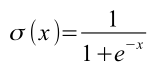
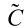

# C 语言实现 LSTM 算法

## LSTM 算法简介

LSTM 全称是 "Long Short-Term Memory"，一种用来学习大量时序序列中隐含的相关性并用于预测其可能的趋势的机器学习算法。它的应用范围包括但不局限于价格走势预测、估计剩余寿命、分析语言的情感趋向、自动写作和语音合成。

算法描述了一个用于计算的工作单元，它按照时间顺序接受自然数作为输入，通过计算得到对应的输出。当一系列输入计算完成时，也就得到了对应的一个输出序列。单个 LSTM 单元的学习能力是有限的，可以将输出的序列作为输入序列给另外一个 LSTM 作为输入，通过这种方式利用多个 LSTM 单元的组合提高整体学习能力。

## LSTM 的计算过程

作为机器学习算法的一种，LSTM 的应用包括利用大量数据进行训练和根据训练得到的参数预测两个步骤。其预测过程使用正向传播算法，训练过程采用误差反向传播算法。

### LSTM 的正向传播算法

一个处理 1 维序列的 LSTM 单元有 12 个参数。这里将这 12 个参数表示为：

假设输入序列 `x` 和输出序列 `h` 分别有 n 个元素，表示为：

每次计算中还会产生以下的临时变量：

最后 LSTM 的计算可以表示为：

里面的一个函数符号表示 Sigmoid 函数：

### LSTM 的误差反向传播算法

假设期望输出为：

采用均方误差（MSE，Mean Squard Error）来评估实际输出与期望输出的误差：

那么在一次正向传播后，LSTM 输出序列 h 的每个元素对 E 的影响可以用下面的一阶偏导数表示：

进行误差反向传播需要使用 E 对 12 个参数的每一个的偏导数。与普通的神经网络算法不同的是，LSTM 利用 C(t-1) 和 h(t-1) 参与第 t 次的计算，使得第 t 次之前的计算结果会对第 t 次的输出 h(t) 产生影响。

由于：

所以 t = 1 时：

当 t > 1 时：

为方便计算，激活函数导数可取：

最后：

一般情况下学习率取值：

采用简单的梯度下降，可以在正向传播后修正参数：

## C 实现方法

用结构体来保存计算过程所需的变量，并提供一个函数用来初始化并返回这个结构体。后续提供一系列的函数用于操作这个结构体。

### 数据结构

结构体中变量名称和算法的参数之间的对应关系是：

<table>
  <tr><th>结构体变量</th><th>定义</th><th>对应算法中的变量</th></tr>
  <tr><td>整数 length</td><td>int length;</td><td>表示 LSTM 计算序列长度</td></tr>
  <tr><td>浮点数指针 x</td><td>double *x;</td><td>输入序列 x</td></tr>
  <tr><td>浮点数指针 h</td><td>double *h;</td><td>输出序列 h</td></tr>
  <tr><td>浮点数指针 f</td><td>double *f;</td><td>中间变量序列 f</td></tr>
  <tr><td>浮点数指针 i</td><td>double *i;</td><td>中间变量序列 i</td></tr>
  <tr><td>浮点数指针 tilde_C</td><td>double *tilde_C;</td><td>中间变量序列 </td></tr>
  <tr><td>浮点数指针 C</td><td>double *C;</td><td>中间变量序列 C</td></tr>
  <tr><td>浮点数指针 o</td><td>double *o;</td><td>中间变量序列 o</td></tr>
  <tr><td>浮点数指针 hat_h</td><td>double *hat_h;</td><td>期望输出序列 </td></tr>
  <tr><td>浮点数 W_fh</td><td>double W_fh;</td><td>参数 </td></tr>
  <tr><td>浮点数 W_fx</td><td>double W_fx;</td><td>参数 </td></tr>
  <tr><td>浮点数 b_f</td><td>double b_f;</td><td>参数 </td></tr>
  <tr><td>浮点数 W_ih</td><td>double W_ih;</td><td>参数 </td></tr>
  <tr><td>浮点数 W_ix</td><td>double W_ix;</td><td>参数 </td></tr>
  <tr><td>浮点数 b_i</td><td>double b_i;</td><td>参数 </td></tr>
  <tr><td>浮点数 W_Ch</td><td>double W_Ch;</td><td>参数 </td></tr>
  <tr><td>浮点数 W_Cx</td><td>double W_Cx;</td><td>参数 </td></tr>
  <tr><td>浮点数 b_C</td><td>double b_C;</td><td>参数 </td></tr>
  <tr><td>浮点数 W_oh</td><td>double W_oh;</td><td>参数 </td></tr>
  <tr><td>浮点数 W_ox</td><td>double W_ox;</td><td>参数 </td></tr>
  <tr><td>浮点数 b_o</td><td>double b_o;</td><td>参数 </td></tr>
</table>

下面的参数不是算法必须的，但是实现时会使用：

<table>
  <tr><th>结构体变量</th><th>定义</th><th>说明</th></tr>
  <tr><td>整数 error_no</td><td>int error_no;</td><td>错误号，无错误默认0。用于记录最后一次程序发生的错误。</td></tr>
  <tr><td>字符指针 error_msg</td><td>char *error_msg;</td><td>发生的错误的文字说明，默认无错误，内容为指向字符串"\0"的指针。</td></tr>
</table>

### 错误编号和错误信息

<table>
  <tr><th>错误号</th><th>信息</th><th>说明</th></tr>
  <tr><td>0</td><td>"\0"</td><td>无错误。</td></tr>
  <tr><td>1</td><td>"not enough memory"</td><td>内存不足。</td></tr>
</table>

### 接口文档

#### 1. `struct lstmlib* lstmlib_create(int length);`

##### 参数

1. `length`：LSTM 接受输入序列的长度。

##### 返回值

返回一个 `struct lstmlib*` 结构体指针，或者失败时返回 `NULL`。

##### 功能

创建一个 LSTM 单元，并返回一个结构体指针。可以对这个结构体指针使用 lstmlib 其他函数进行操作。`lstmlib_create` 方法会自动调用 `lstmlib_random_params` 对参数进行初始化赋值，赋值的范围是[-1,1]。

#### 2. `char lstmlib_random_params(struct lstmlib *unit, double min, double max);`

##### 参数

1. `unit`：一个 LSTM 单元结构体指针。
2. `min`：最小值。
3. `max`：最大值。

##### 返回值

成功返回 `1`，失败返回`0`。

##### 功能

对指定的 LSTM 单元的参数进行随机初始化，初始化的范围是[`min`, `max`]。

#### 3. `char lstmlib_run(struct lstmlib *unit, double *input, double *output);`

##### 参数

1. `unit`：一个 LSTM 单元结构体指针。
2. `input`：输入浮点数数组指针。
3. `output`：输出浮点数数组指针。

##### 返回值

执行成功返回 `1`，失败返回`0`。

##### 功能

以指定`input`、`output`作为输入输出区域，运行 LSTM。

#### 4. `char lstmlib_run_unit(struct lstmlib *unit);`

##### 参数

1. `unit`：一个 LSTM 单元结构体指针。

##### 返回值

执行成功返回 `1`，失败返回`0`。

##### 功能

运行 LSTM。

#### 5. `double lstmlib_get_mse(struct lstmlib *unit);`

##### 参数

1. `unit`：LSTM 单元结构体。

##### 返回值

一个浮点数，MSE。

### 6. `char lstmlib_fit_unit(struct lstmlib *unit, double lr);`

#### 参数

1. `unit`：一个 LSTM 单元结构体指针。
2. `lr`：浮点数，学习速率。

##### 返回值

执行成功返回 `1`，失败返回`0`。

##### 功能

进行反向梯度下降，修正参数。

### 7. `int lstmlib_save(struct lstmlib *unit, char *file_name);`

#### 参数

1. `unit`：一个 LSTM 单元结构体指针。
2. `file_name`：文件名。

##### 返回值

返回写如文件的字节数。

##### 功能

保存 LSTM 到文件。

## 测试

`test_sin_cos.c`，正弦到余弦的转换

`test_rectangle_cos_pre.c`，方波到余弦的转换

`test_params_change.c`，正弦到方波的训练过程中各参数的变化情况

参数变化随着MSE的下降趋于稳定，变化过程平滑不存在突然的跳变。训练结束后LSTM的输出值趋近与期望值。这些特点表明算法的实现与理论一致，是没有问题的。

## 有噪声的情况下

后来，对`test_sin_cos_pre.c`进行些改动后测试了带噪声的情况。假如对输出序列`hat_h`增加`+-0.1`的平均噪声，结果如下：

如果只对输入序列`x`添加噪声，相同情况训练出来的结果是：

如果对`x`和`hat_h`都添加噪声，相同情况训练出来的结果是：

